Google Data Analytics Course Capstone Project
================
Mark Mukasa

# Introduction


In 2016, Cyclistic launched a successful bike-share program, which has
grown to a fleet of 5,824 bicycles that are geo-tracked and locked into
a network of 692 stations across Chicago. The bikes can be unlocked from
one station and returned to any other station in the system anytime. The
business has flexible pricing plans: single-ride passes, full-day
passes, and annual memberships. Customers who purchase annual
memberships are referred to as Cyclistic members, and those that
purchase single-ride or full-day passes are referred to as casual
riders. I assume the position of Junior data analyst working in the
marketing team at Cyclistic. The team wants to understand how casual
riders and annual members use Cyclistic bikes differently, in order to
design a new marketing strategy to convert casual riders into annual
members.

**Business Task**

Utilise Cyclistic’s historical bike trip data to derive analysis to
understand the usage trends and behaviours of the 2 customer segments.

# Loading Packages and Data

``` r
library(tidyverse)

library(janitor)

library(skimr)

library(lubridate)

library(stringr)
```

## Loading the data

``` r
trips1 <- read_csv("202101-divvy-tripdata.csv")

trips2 <- read_csv("202102-divvy-tripdata.csv")

trips3 <- read_csv("202103-divvy-tripdata.csv")

trips4 <- read_csv("202104-divvy-tripdata.csv")

trips5 <- read_csv("202105-divvy-tripdata.csv")

trips6 <- read_csv("202106-divvy-tripdata.csv")

trips7 <- read_csv("202107-divvy-tripdata.csv")

trips8 <- read_csv("202108-divvy-tripdata.csv")

trips9 <- read_csv("202109-divvy-tripdata.csv")

trips10 <- read_csv("202110-divvy-tripdata.csv")

trips11 <- read_csv("202111-divvy-tripdata.csv")

trips12 <- read_csv("202112-divvy-tripdata.csv")

trips_full <- bind_rows(trips1, trips2, trips3, trips4, trips5, trips6, trips7, trips8, trips9, trips10, trips11, trips12)
```

## Data Structure

``` r
glimpse(trips_full)
```

    ## Rows: 5,595,063
    ## Columns: 13
    ## $ ride_id            <chr> "E19E6F1B8D4C42ED", "DC88F20C2C55F27F", "EC45C94683~
    ## $ rideable_type      <chr> "electric_bike", "electric_bike", "electric_bike", ~
    ## $ started_at         <dttm> 2021-01-23 16:14:19, 2021-01-27 18:43:08, 2021-01-~
    ## $ ended_at           <dttm> 2021-01-23 16:24:44, 2021-01-27 18:47:12, 2021-01-~
    ## $ start_station_name <chr> "California Ave & Cortez St", "California Ave & Cor~
    ## $ start_station_id   <chr> "17660", "17660", "17660", "17660", "17660", "17660~
    ## $ end_station_name   <chr> NA, NA, NA, NA, NA, NA, NA, NA, NA, "Wood St & Augu~
    ## $ end_station_id     <chr> NA, NA, NA, NA, NA, NA, NA, NA, NA, "657", "13258",~
    ## $ start_lat          <dbl> 41.90034, 41.90033, 41.90031, 41.90040, 41.90033, 4~
    ## $ start_lng          <dbl> -87.69674, -87.69671, -87.69664, -87.69666, -87.696~
    ## $ end_lat            <dbl> 41.89000, 41.90000, 41.90000, 41.92000, 41.90000, 4~
    ## $ end_lng            <dbl> -87.72000, -87.69000, -87.70000, -87.69000, -87.700~
    ## $ member_casual      <chr> "member", "member", "member", "member", "casual", "~

``` r
str(trips_full)
```

    ## spec_tbl_df [5,595,063 x 13] (S3: spec_tbl_df/tbl_df/tbl/data.frame)
    ##  $ ride_id           : chr [1:5595063] "E19E6F1B8D4C42ED" "DC88F20C2C55F27F" "EC45C94683FE3F27" "4FA453A75AE377DB" ...
    ##  $ rideable_type     : chr [1:5595063] "electric_bike" "electric_bike" "electric_bike" "electric_bike" ...
    ##  $ started_at        : POSIXct[1:5595063], format: "2021-01-23 16:14:19" "2021-01-27 18:43:08" ...
    ##  $ ended_at          : POSIXct[1:5595063], format: "2021-01-23 16:24:44" "2021-01-27 18:47:12" ...
    ##  $ start_station_name: chr [1:5595063] "California Ave & Cortez St" "California Ave & Cortez St" "California Ave & Cortez St" "California Ave & Cortez St" ...
    ##  $ start_station_id  : chr [1:5595063] "17660" "17660" "17660" "17660" ...
    ##  $ end_station_name  : chr [1:5595063] NA NA NA NA ...
    ##  $ end_station_id    : chr [1:5595063] NA NA NA NA ...
    ##  $ start_lat         : num [1:5595063] 41.9 41.9 41.9 41.9 41.9 ...
    ##  $ start_lng         : num [1:5595063] -87.7 -87.7 -87.7 -87.7 -87.7 ...
    ##  $ end_lat           : num [1:5595063] 41.9 41.9 41.9 41.9 41.9 ...
    ##  $ end_lng           : num [1:5595063] -87.7 -87.7 -87.7 -87.7 -87.7 ...
    ##  $ member_casual     : chr [1:5595063] "member" "member" "member" "member" ...
    ##  - attr(*, "spec")=
    ##   .. cols(
    ##   ..   ride_id = col_character(),
    ##   ..   rideable_type = col_character(),
    ##   ..   started_at = col_datetime(format = ""),
    ##   ..   ended_at = col_datetime(format = ""),
    ##   ..   start_station_name = col_character(),
    ##   ..   start_station_id = col_character(),
    ##   ..   end_station_name = col_character(),
    ##   ..   end_station_id = col_character(),
    ##   ..   start_lat = col_double(),
    ##   ..   start_lng = col_double(),
    ##   ..   end_lat = col_double(),
    ##   ..   end_lng = col_double(),
    ##   ..   member_casual = col_character()
    ##   .. )
    ##  - attr(*, "problems")=<externalptr>

``` r
head(trips_full)
```

    ## # A tibble: 6 x 13
    ##   ride_id rideable_type started_at          ended_at            start_station_n~
    ##   <chr>   <chr>         <dttm>              <dttm>              <chr>           
    ## 1 E19E6F~ electric_bike 2021-01-23 16:14:19 2021-01-23 16:24:44 California Ave ~
    ## 2 DC88F2~ electric_bike 2021-01-27 18:43:08 2021-01-27 18:47:12 California Ave ~
    ## 3 EC45C9~ electric_bike 2021-01-21 22:35:54 2021-01-21 22:37:14 California Ave ~
    ## 4 4FA453~ electric_bike 2021-01-07 13:31:13 2021-01-07 13:42:55 California Ave ~
    ## 5 BE5E8E~ electric_bike 2021-01-23 02:24:02 2021-01-23 02:24:45 California Ave ~
    ## 6 5D8969~ electric_bike 2021-01-09 14:24:07 2021-01-09 15:17:54 California Ave ~
    ## # ... with 8 more variables: start_station_id <chr>, end_station_name <chr>,
    ## #   end_station_id <chr>, start_lat <dbl>, start_lng <dbl>, end_lat <dbl>,
    ## #   end_lng <dbl>, member_casual <chr>

# Data Cleaning

## Cleaning strings for start and end station names

``` r
trips_full <- trips_full %>% mutate(start_station_name = str_trim(start_station_name, side = "both"),
                                    end_station_name = str_trim(end_station_name, side = "both"))
```

## Exploring the rideable_type column

``` r
trips_full %>% count(rideable_type)
```

    ## # A tibble: 3 x 2
    ##   rideable_type       n
    ##   <chr>           <int>
    ## 1 classic_bike  3251028
    ## 2 docked_bike    312343
    ## 3 electric_bike 2031692

We see that there are 3 levels; classic_bike, docked_bike, electric
bike. Since the classic and docked bike can be considered the same type,
we’ll change the docked_bike to classic_bike for this dataset.

``` r
trips_clean <- trips_full %>% 
              mutate(rideable_type = str_replace(rideable_type, "docked_bike", "classic_bike"))
trips_clean %>% count(rideable_type)
```

    ## # A tibble: 2 x 2
    ##   rideable_type       n
    ##   <chr>           <int>
    ## 1 classic_bike  3563371
    ## 2 electric_bike 2031692

## Handling NAs in the start- and end-station names

Since all classic_bikes must start and end at a docking station, we
shall remove all classic_bike trips that have NAs for either start or
end station names.

``` r
trips_clean_na <- trips_clean %>% filter(!(rideable_type == "classic_bike" & (is.na(start_station_name) | is.na(end_station_name))))
trips_clean_na
```

    ## # A tibble: 5,585,729 x 13
    ##    ride_id          rideable_type started_at          ended_at           
    ##    <chr>            <chr>         <dttm>              <dttm>             
    ##  1 E19E6F1B8D4C42ED electric_bike 2021-01-23 16:14:19 2021-01-23 16:24:44
    ##  2 DC88F20C2C55F27F electric_bike 2021-01-27 18:43:08 2021-01-27 18:47:12
    ##  3 EC45C94683FE3F27 electric_bike 2021-01-21 22:35:54 2021-01-21 22:37:14
    ##  4 4FA453A75AE377DB electric_bike 2021-01-07 13:31:13 2021-01-07 13:42:55
    ##  5 BE5E8EB4E7263A0B electric_bike 2021-01-23 02:24:02 2021-01-23 02:24:45
    ##  6 5D8969F88C773979 electric_bike 2021-01-09 14:24:07 2021-01-09 15:17:54
    ##  7 09275CC10F854E9E electric_bike 2021-01-04 05:05:04 2021-01-04 05:10:39
    ##  8 DF7A32A217AEFB14 electric_bike 2021-01-14 15:07:00 2021-01-14 15:13:40
    ##  9 C2EFC62379EB716C electric_bike 2021-01-09 09:57:55 2021-01-09 10:00:26
    ## 10 B9F73448DFBE0D45 classic_bike  2021-01-24 19:15:38 2021-01-24 19:22:51
    ## # ... with 5,585,719 more rows, and 9 more variables: start_station_name <chr>,
    ## #   start_station_id <chr>, end_station_name <chr>, end_station_id <chr>,
    ## #   start_lat <dbl>, start_lng <dbl>, end_lat <dbl>, end_lng <dbl>,
    ## #   member_casual <chr>

## Creating new useful columns

We’ll now create new columns that help us understand the user behaviors.

``` r
trips_clean_dt <- trips_clean_na %>% 
  mutate(month = month(started_at, label = TRUE),
              day_of_week = wday(started_at, label = TRUE),
              hour_of_day = hour(started_at),
              ride_duration_hrs = difftime(ended_at, started_at, units = "hours"),
              ride_duration_mins = difftime(ended_at, started_at, units = "mins"),
              route = str_c(start_station_name, end_station_name, sep = "--"))
head(trips_clean_dt)
```

    ## # A tibble: 6 x 19
    ##   ride_id rideable_type started_at          ended_at            start_station_n~
    ##   <chr>   <chr>         <dttm>              <dttm>              <chr>           
    ## 1 E19E6F~ electric_bike 2021-01-23 16:14:19 2021-01-23 16:24:44 California Ave ~
    ## 2 DC88F2~ electric_bike 2021-01-27 18:43:08 2021-01-27 18:47:12 California Ave ~
    ## 3 EC45C9~ electric_bike 2021-01-21 22:35:54 2021-01-21 22:37:14 California Ave ~
    ## 4 4FA453~ electric_bike 2021-01-07 13:31:13 2021-01-07 13:42:55 California Ave ~
    ## 5 BE5E8E~ electric_bike 2021-01-23 02:24:02 2021-01-23 02:24:45 California Ave ~
    ## 6 5D8969~ electric_bike 2021-01-09 14:24:07 2021-01-09 15:17:54 California Ave ~
    ## # ... with 14 more variables: start_station_id <chr>, end_station_name <chr>,
    ## #   end_station_id <chr>, start_lat <dbl>, start_lng <dbl>, end_lat <dbl>,
    ## #   end_lng <dbl>, member_casual <chr>, month <ord>, day_of_week <ord>,
    ## #   hour_of_day <int>, ride_duration_hrs <drtn>, ride_duration_mins <drtn>,
    ## #   route <chr>

### Cleaning ride duration

We’d like to exclude all rides that are longer than a day and those that
are shorter than one minute.

``` r
cleaned_df <- trips_clean_dt %>% filter(ride_duration_hrs <24) %>% 
                    filter(ride_duration_mins > 1)  
head(cleaned_df)
```

    ## # A tibble: 6 x 19
    ##   ride_id rideable_type started_at          ended_at            start_station_n~
    ##   <chr>   <chr>         <dttm>              <dttm>              <chr>           
    ## 1 E19E6F~ electric_bike 2021-01-23 16:14:19 2021-01-23 16:24:44 California Ave ~
    ## 2 DC88F2~ electric_bike 2021-01-27 18:43:08 2021-01-27 18:47:12 California Ave ~
    ## 3 EC45C9~ electric_bike 2021-01-21 22:35:54 2021-01-21 22:37:14 California Ave ~
    ## 4 4FA453~ electric_bike 2021-01-07 13:31:13 2021-01-07 13:42:55 California Ave ~
    ## 5 5D8969~ electric_bike 2021-01-09 14:24:07 2021-01-09 15:17:54 California Ave ~
    ## 6 09275C~ electric_bike 2021-01-04 05:05:04 2021-01-04 05:10:39 California Ave ~
    ## # ... with 14 more variables: start_station_id <chr>, end_station_name <chr>,
    ## #   end_station_id <chr>, start_lat <dbl>, start_lng <dbl>, end_lat <dbl>,
    ## #   end_lng <dbl>, member_casual <chr>, month <ord>, day_of_week <ord>,
    ## #   hour_of_day <int>, ride_duration_hrs <drtn>, ride_duration_mins <drtn>,
    ## #   route <chr>

# Data Visualizations

## Ride Count Per Month

``` r
ggplot(cleaned_df, aes(x= month, color = "blue")) +
  geom_bar() +
  labs(title = "Ride Count by Month", y = "Ride Count", x = "Month")
```

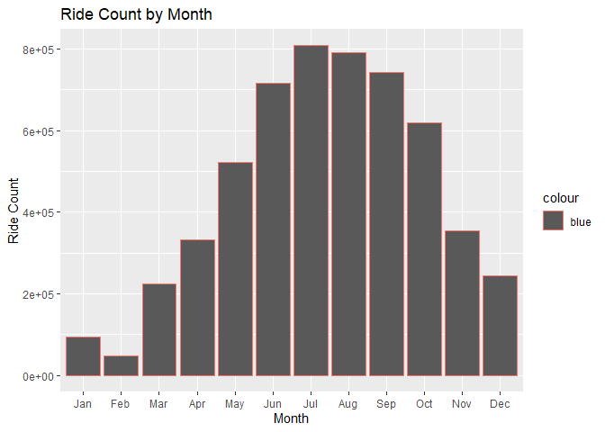<!-- -->

We can see that number of rides increased towards the summer months, and
decreased between December and Feb (winter).

To investigate this further, we can plot the average number of rides for
the various seasons.

### Creating seasons from our data

``` r
season_df <- cleaned_df %>%  mutate(season = case_when(
  month %in% c("Dec", "Jan", "Feb") ~ "Winter",
  month %in% c("Mar", "Apr", "May") ~ "Spring",
  month %in% c("Jun", "Jul", "Aug") ~ "Summer",
  TRUE ~ "Autumn")) %>% 
  mutate(season = factor(season, levels = c("Winter", "Spring", "Summer", "Autumn")))
```

Plotting the ride count by season;

``` r
ggplot(season_df, aes(x= season)) +
  geom_bar() +
  labs(y = "Ride Count", x = "Season", title = "Ride Count By Season")
```

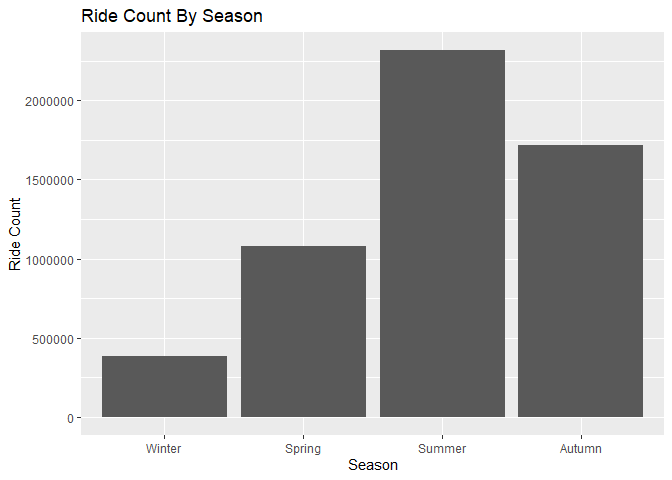<!-- -->

### Ride Count by Customer Type

``` r
ggplot(season_df, aes(x= member_casual)) +
  geom_bar(aes(fill = member_casual), width = .5) +
  coord_flip() + 
  labs(title= "Ride Count by Customer Type", y = "Ride Count", x = "Customer Type")
```

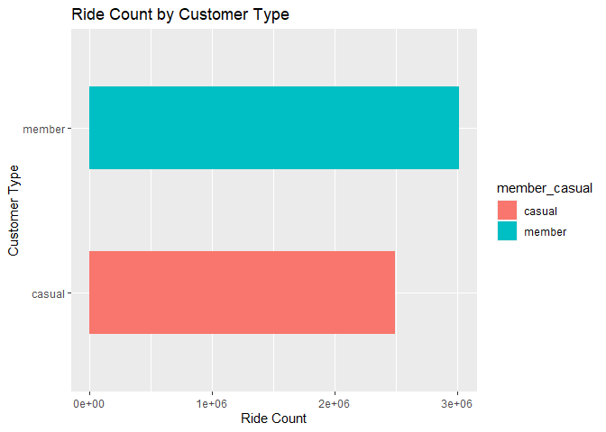<!-- -->

### Bike Type

``` r
season_df %>% 
  count(rideable_type)
```

    ## # A tibble: 2 x 2
    ##   rideable_type       n
    ##   <chr>           <int>
    ## 1 classic_bike  3508630
    ## 2 electric_bike 1989945

### Bike type usage by month

``` r
season_df %>% 
   
  ggplot(aes(x= month, fill = rideable_type)) + 
  geom_bar(stat = "count", position = "dodge") +
  labs(title = "Bike Type Usage per Month", y = "Ride Count", x = "Month")
```

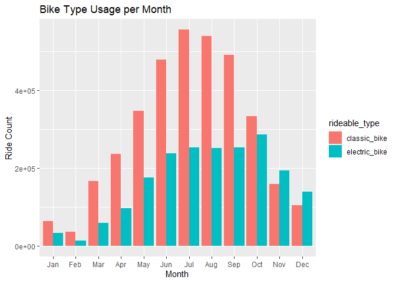<!-- -->

Electric bikes were used more compared to classic bikes in November and
December, whereas classic bikes usage outnumbered that of electric bikes
throughout the rest of the year.

## Ride count by month, by customer type

``` r
season_df %>% 
  count(month, member_casual)
```

    ## # A tibble: 24 x 3
    ##    month member_casual      n
    ##    <ord> <chr>          <int>
    ##  1 Jan   casual         17787
    ##  2 Jan   member         77313
    ##  3 Feb   casual          9841
    ##  4 Feb   member         38399
    ##  5 Mar   casual         82879
    ##  6 Mar   member        142149
    ##  7 Apr   casual        134557
    ##  8 Apr   member        197246
    ##  9 May   casual        252625
    ## 10 May   member        269579
    ## # ... with 14 more rows

``` r
season_df %>% 
  ggplot(aes(month, fill = member_casual)) + 
  geom_bar(stat = "count", position = "dodge") +
  labs(title = "Ride Count by Month and Customer Type", y = "Ride Count", x = "Month")
```

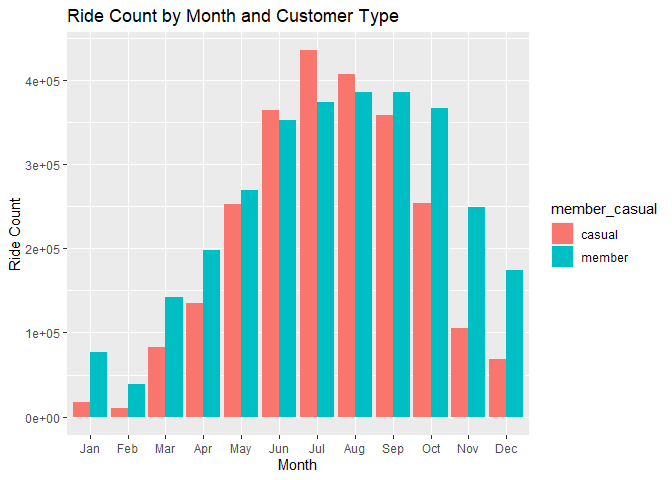<!-- -->

It can be noted that rides by members outnumbered those by casual rides
over the year. However, towards the summer months, casual rides tend to
outnumber member rides. To further explore this, let’s look at the
distribution by season.

### Ride count by season, by customer type

``` r
season_df %>% 
  count(season, member_casual)
```

    ## # A tibble: 8 x 3
    ##   season member_casual       n
    ##   <fct>  <chr>           <int>
    ## 1 Winter casual          96171
    ## 2 Winter member         290308
    ## 3 Spring casual         470061
    ## 4 Spring member         608974
    ## 5 Summer casual        1205251
    ## 6 Summer member        1110543
    ## 7 Autumn casual         716572
    ## 8 Autumn member        1000695

``` r
season_df %>% 
  ggplot(aes(member_casual, fill = member_casual)) + 
  geom_bar(stat = "count", width = .6) +
  facet_wrap(~season) +
  labs(title = "Ride Count By Customer Type Over Seasons", y = "Ride Count", x = "Customer Type")
```

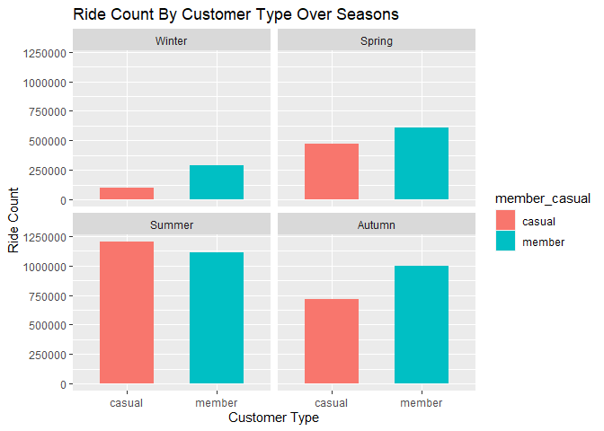<!-- -->

The above chart confirms that casual rides outnumbered member rides only
in the summer months.

## Distribution of rides by day of week

``` r
season_df %>% 
  count(day_of_week, sort = TRUE)
```

    ## # A tibble: 7 x 2
    ##   day_of_week      n
    ##   <ord>        <int>
    ## 1 Sat         973508
    ## 2 Sun         841765
    ## 3 Fri         796448
    ## 4 Wed         743443
    ## 5 Tue         727558
    ## 6 Thu         725352
    ## 7 Mon         690501

From the above chart, we can see that Saturday is the most popular day,
followed by sunday, and Monday is the least popular. We can explore this
for the different customer type.

``` r
season_df %>% 
  count(day_of_week, member_casual)
```

    ## # A tibble: 14 x 3
    ##    day_of_week member_casual      n
    ##    <ord>       <chr>          <int>
    ##  1 Sun         casual        473055
    ##  2 Sun         member        368710
    ##  3 Mon         casual        281769
    ##  4 Mon         member        408732
    ##  5 Tue         casual        270057
    ##  6 Tue         member        457501
    ##  7 Wed         casual        274499
    ##  8 Wed         member        468944
    ##  9 Thu         casual        281572
    ## 10 Thu         member        443780
    ## 11 Fri         casual        358143
    ## 12 Fri         member        438305
    ## 13 Sat         casual        548960
    ## 14 Sat         member        424548

``` r
season_df %>% 
  ggplot(aes(factor(day_of_week, levels = c("Mon", "Tue", "Wed", "Thu", "Fri", "Sat", "Sun")), fill = member_casual)) + 
  geom_bar(stat = "count", position = "dodge") +
  labs(y = "Ride count", x= "Day of the Week", title = "Ride distribution by Day of the Week")
```

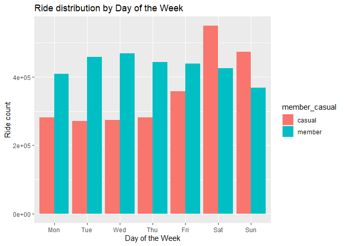<!-- -->

Following from above, we can see that during the week, member rides
outnumbered the casual rides, whereas over the weekend, the casual rides
outnumbered member rides significantly.

We’ll explore this more over seasons

``` r
season_df %>% 
  ggplot(aes(factor(day_of_week, levels = c("Mon", "Tue", "Wed", "Thu", "Fri", "Sat", "Sun")), fill = member_casual)) + 
  geom_bar(stat = "count", position = "dodge") +
  facet_wrap(~ season) +
  labs(y = "Ride count", x= "Day of the Week", title = "Ride Distribution By Day of Week over Seasons")
```

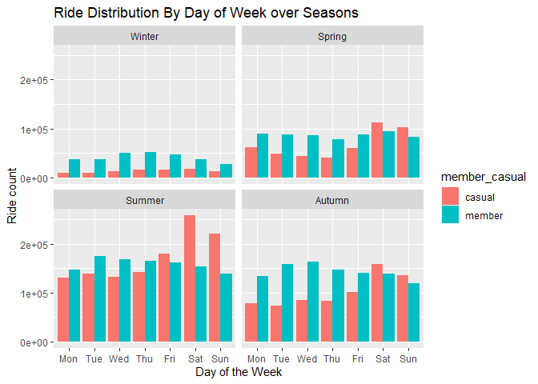<!-- -->

We can see that the hypothesis is consistent with for all seasons, save
for winter.

### Ride Duration

``` r
season_df %>% 
  group_by(day_of_week) %>% 
  summarise(avg_duration = mean(ride_duration_mins)) %>% 
  ungroup() %>% 
  ggplot(aes(x= (factor(day_of_week, levels = c("Mon", "Tue", "Wed", "Thu", "Fri", 
                                                "Sat", "Sun"))), y = avg_duration, 
                                                group = 1)) + 
  geom_line() + 
  labs(y = "Average Ride Duration", x= "Day of the Week", title = "Average Ride Duration By Day of Week")
```

    ## Don't know how to automatically pick scale for object of type difftime. Defaulting to continuous.

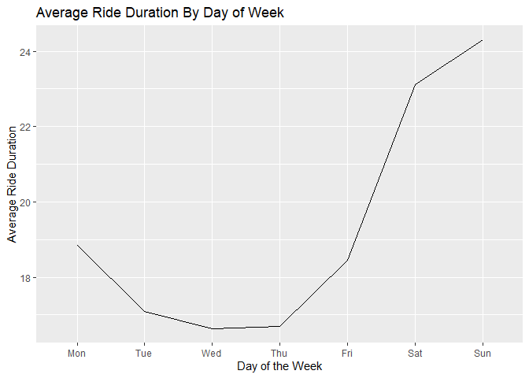<!-- -->

The average ride duration varies widely by day. the lowest is on
Wednesday., with the highest on Sundays. From the above graph, it can
deduced that customers ride longer over the weekends. Let’s investigate
this further.

``` r
season_df %>% 
  group_by(day_of_week, member_casual) %>% 
  summarise(avg_duration = mean(ride_duration_mins)) %>% 
  ungroup() %>% 
  ggplot(aes(x= (factor(day_of_week, levels = c("Mon", "Tue", "Wed", "Thu", "Fri", "Sat", "Sun"))), y = avg_duration, group = member_casual)) + geom_line(aes(color = member_casual,)) + 
  labs(y = "Average Ride Duration", x= "Day of the Week", title = "Average Ride duration By Day of Week & Customer Type")
```

    ## `summarise()` has grouped output by 'day_of_week'. You can override using the
    ## `.groups` argument.
    ## Don't know how to automatically pick scale for object of type difftime.
    ## Defaulting to continuous.

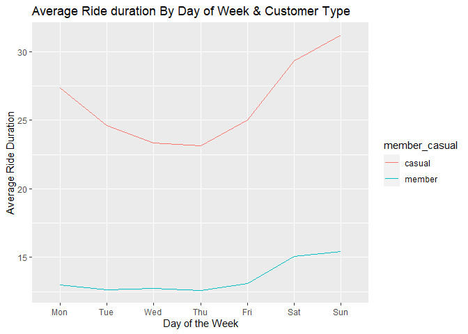<!-- -->

On average, members ride for shorter times compared to casual riders,
whose ride duration is almost twice that of members. It is cleat that
Sundays have the longest duration, followed by Saturdays for both
members and casual riders.

**Investigating this across seasons;**

``` r
season_df %>% 
  group_by(season, day_of_week, member_casual) %>% 
  summarise(avg_duration = mean(ride_duration_mins)) %>% 
  ungroup() %>% 
  ggplot(aes(x= (factor(day_of_week, levels = c("Mon", "Tue", "Wed", "Thu", "Fri", "Sat", "Sun"))), y = avg_duration, group = member_casual)) + geom_line(aes(color = member_casual,)) + 
  facet_wrap(~season) +
  labs(y = "Average Ride Duration (mins)", x= "Day of the Week", title = "Average Ride duration By Day of Week & Customer Type Over Seasons")
```

    ## `summarise()` has grouped output by 'season', 'day_of_week'. You can override
    ## using the `.groups` argument.
    ## Don't know how to automatically pick scale for object of type difftime.
    ## Defaulting to continuous.

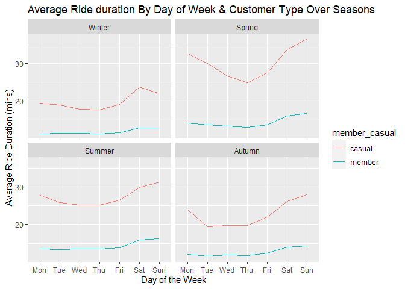<!-- -->

On average, spring months have the highest ride duration, followed by
summer, autumn, and winter has the shortest ride duration. This seems to
be consistent with activity across the seasons; Due to the cold, people
tend to choose to stay indoors and only take rides only when necessary,
which accounts for the short trips. On the other hand, for warmer
seasons, customers tend to ride the bikes longer as its more conducive.
Customers tend to have longer trips on Sundays over the summer, autumn,
and fall. However, during winter, Saturdays are preferred.

### Preferred ride times

This is split between weekdays and weekends.

``` r
season_df %>% 
  mutate(week_end_day = case_when(
    day_of_week %in% c("Sat", "Sun") ~ "weekend",
    TRUE ~ "weekday")) %>% 
  filter(week_end_day == "weekend") %>% 
  group_by(season,hour_of_day, member_casual) %>% 
  summarize(total_rides = n()) %>% 
  ggplot(aes(x= hour_of_day, y = total_rides, group = member_casual)) +
  geom_line(aes(color = member_casual)) +
  scale_x_continuous(breaks = seq(0,24,2)) +
  labs(title = "Weekend ride start times by Season") +
  facet_wrap(~season)
```

    ## `summarise()` has grouped output by 'season', 'hour_of_day'. You can override
    ## using the `.groups` argument.

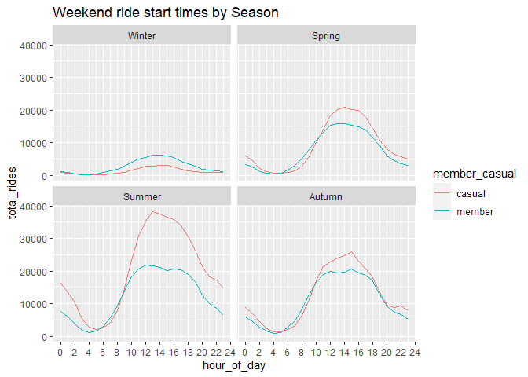<!-- -->

As seen from the graph above, the most popular start time for casual
rides is during Summer weekends at 1 PM, where as for members it’s
summer weekends at noon. Generally, across all seasons, the most popular
weekend ride start time period is noon to 5PM.

``` r
season_df %>% 
  mutate(week_end_day = case_when(
    day_of_week %in% c("Sat", "Sun") ~ "weekend",
    TRUE ~ "weekday")) %>% 
  filter(week_end_day == "weekday") %>% 
  group_by(season,hour_of_day, member_casual) %>% 
  summarize(total_rides = n()) %>% 
  ggplot(aes(x= hour_of_day, y = total_rides, group = member_casual)) +
  geom_line(aes(color = member_casual)) +
  scale_x_continuous(breaks = seq(0,24,2)) +
  labs(title = "Weekday ride start times by Season") +
  facet_wrap(~season)
```

    ## `summarise()` has grouped output by 'season', 'hour_of_day'. You can override
    ## using the `.groups` argument.

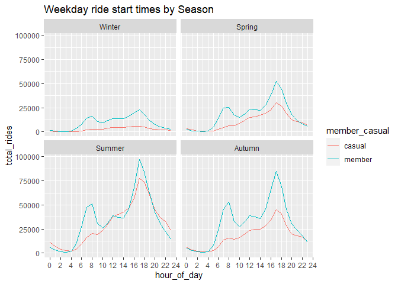<!-- -->

For week days(Mon-Fri), we see 3 peaks, one at 8 AM, the second at noon,
and the third at 5 PM for the members. For casual rides, we see a
gradual increase in ride counts from 8AM to 5PM, with 5PM having the
highest ride count.

## Top routes

``` r
season_df %>% 
  group_by(route) %>% 
  summarise(total_rides = n()) %>% 
  arrange(desc(total_rides))
```

    ## # A tibble: 153,026 x 2
    ##    route                                                total_rides
    ##    <chr>                                                      <int>
    ##  1 <NA>                                                      971559
    ##  2 Streeter Dr & Grand Ave--Streeter Dr & Grand Ave           11907
    ##  3 Michigan Ave & Oak St--Michigan Ave & Oak St                6094
    ##  4 Millennium Park--Millennium Park                            5951
    ##  5 Ellis Ave & 60th St--Ellis Ave & 55th St                    5098
    ##  6 Lake Shore Dr & Monroe St--Lake Shore Dr & Monroe St        4810
    ##  7 Ellis Ave & 55th St--Ellis Ave & 60th St                    4613
    ##  8 Ellis Ave & 60th St--University Ave & 57th St               3685
    ##  9 Streeter Dr & Grand Ave--Millennium Park                    3607
    ## 10 Theater on the Lake--Theater on the Lake                    3565
    ## # ... with 153,016 more rows

## Summary of Insights

Based on my analysis, here’s what I can deduce about the behaviour of
Cyclistic customers.

**Members**

-   Average 3.2K rides per day in winter(lowest) to 12K rides per day in
    Summer. Annual average is 8.2K rides per day. On weekdays, the
    average number of trips per day is 8.5K, as opposed to 7.6K rides
    per day over the weekends.
-   73.65% of rides occur during the week (Mon-Fri).
-   Members have an average ride duration of 13 mins. It’s highest in
    Summer(14.22 mins) and lowest in Autumn (12.29 mins). On weekends,
    the average ride duration is 15 mins, and 12.81 mins on weekdays.
-   Most popular commute times: 8AM, 12PM and 5PM on the weekdays. over
    the weekends, the most popular commute time is between 12PM and 3PM.
-   Most used dock station(pickup — drop off) route: *Ellis Ave & 60th
    St — Ellis Ave & 55th St.*

From the analysis, members most likely use Cyclistic bikes for their
Home-Work commutes. This is explained by the average ride counts on
weekdays, and the peak ride start times, which correspond to the morning
(8AM) work commute, and the evening (5PM) home commute. The average ride
duration is almost constant over the course of the week.

**Casual Riders**

-   Average 1K rides per day in winter(lowest) to 13K rides per day in
    Summer(highest). - Annual average is 6.8K rides per day. On
    weekdays, the average number of trips per day is 5.6K, as opposed to
    9.8K rides per day over the weekends.
-   59% of rides occur during the week (Mon-Fri).
-   Casual riders have an average ride duration of 24.79 mins. It’s
    highest in spring (28.13 mins) and lowest in Autumn (20.97 mins). On
    weekends, the average ride duration is 28.40 mins, and 23.35 mins on
    weekdays.
-   Most popular commute times: 5PM on the weekdays. Over the weekends,
    the most popular commute time is between 11AM and 3PM.
-   Most used dock station(pickup — drop off) route: *Streeter Dr &
    Grand Ave — Streeter Dr & Grand Ave*

From the analysis, the average casual rider uses Cyclistic bikes for
leisure/ fitness purposes. This is supported by the fact that the
highest ride count occurs in the summer months during the summer
holidays, with little activity in the winter months. In addition, the
highest ride counts occur over the weekend (Saturday & Sunday), with an
average ride duration almost twice that of members.

## Recommendations

Now that we know the usage habits of casual riders, I’d suggest the
following recommendations to the marketing team.

-   Design a new annual membership plan targeting fitness and wellness
    enthusiasts. Ideally, this plan should aim to maximise bike usage by
    providing access to customers during the weekdays from 5PM, and
    weekends.
-   To further target that select group, Cyclistic could establish
    partnerships with companies in the wellness and fitness industry to
    provide this new offering to their customers.
-   In order to reach the already existing casual riders, marketing
    campaigns should be launched at the most popular stations in the
    spring & run throughout the summer months, especially on the
    weekends to draw the attention of casual riders to the new offering.
